# Flower Shop Web App - Laravel Project 🌸

---
# Thông tin cá nhân :
**👩‍🎓 Họ và tên :** Nguyễn Thị Huyền Trang - 
**🎓Mã sinh viên:** 23010181

---
## 1. Giới thiệu

Dự án xây dựng một ứng dụng web quản lý cửa hàng hoa sử dụng **framework Laravel (12.x)**, đáp ứng các yêu cầu thiết kế ứng dụng web theo tiêu chuẩn học tập.

Ứng dụng tập trung vào việc quản lý 3 đối tượng chính:
- **User**
- **Product**
- **Order**

Bao gồm các chức năng:
- Xác thực và phân quyền người dùng (Admin/User)
- Chức năng CRUD cho sản phẩm và đơn hàng

---

## 2. Yêu cầu và phân tích

### 2.1. Yêu cầu kỹ thuật

- **Framework**: Laravel 12.x + Breeze
- **Chức năng chính**:
  - Xác thực & phân quyền (Auth/AuthZ) với Breeze
  - CRUD cho Order
- **Bảo mật**:
  - CSRF Protection với `@csrf`
  - XSS Prevention với `{{ e() }}`
  - Validation với Laravel `rules`
  - Middleware Auth & Role
  - SQL Injection: phòng chống qua Eloquent & Query Builder
- **Database**: Aiven for MySQL (cloud)
- **Migrate**: sử dụng Eloquent ORM

### 2.2. Phân tích đối tượng

- **User**
  - Đăng nhập, phân quyền (admin/user)
- **Product**
  - Quản lý tên, giá, danh mục
- **Order**
  - Quản lý đơn hàng: liên kết với User & Product
  - Trạng thái: `pending`, `confirmed`, `completed`

---


## 3. Cơ sở dữ liệu (MySQL - Aiven)

Các bảng chính (được migrate qua Eloquent):

#### `users` table
| Tên cột           | Kiểu dữ liệu      |
|-------------------|-------------------|
| id                | integer, PK        |
| name              | varchar            |
| email             | varchar            |
| password          | varchar            |
| role              | varchar            |
| email_verified_at | timestamp          |
| created_at        | timestamp          |
| updated_at        | timestamp          |

#### `products` table
| Tên cột   | Kiểu dữ liệu      |
|-----------|-------------------|
| id        | integer, PK        |
| name      | varchar            |
| price     | decimal            |
| category_id | integer, FK     |
| created_at | timestamp        |
| updated_at | timestamp        |

#### `orders` table
| Tên cột   | Kiểu dữ liệu      |
|-----------|-------------------|
| id        | integer, PK        |
| user_id   | integer, FK        |
| product_id | integer, FK       |
| quantity  | integer            |
| status    | varchar            |
| created_at | timestamp         |
| updated_at | timestamp         |

---
## Sơ đồ khối 
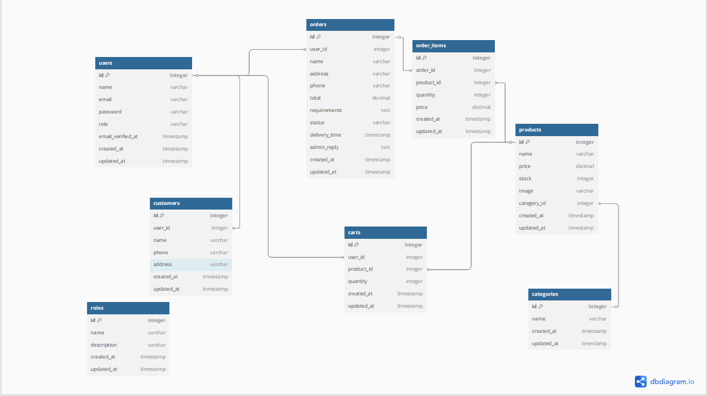
## Sơ đồ chức năng 
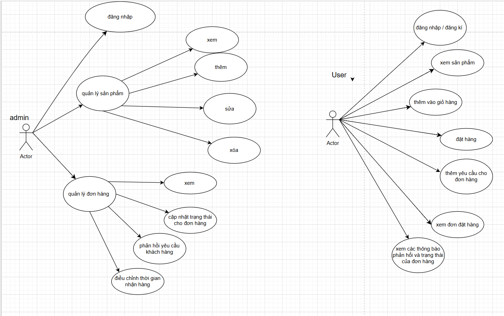

## 4. Một số code minh họa 
**MODLE**

## User Model
```
class User extends Authenticatable
{
    use HasFactory, Notifiable;

    public const ROLE_ADMIN = 'admin';
    public const ROLE_USER = 'user';

    protected $fillable = [
        'name',
        'email',
        'password',
        'role',
    ];

    protected $hidden = [
        'password',
        'remember_token',
    ];

    protected $casts = [
        'email_verified_at' => 'datetime',
        'password' => 'hashed',
    ];

    public function isAdmin(): bool
    {
        return $this->role === self::ROLE_ADMIN;
    }

    public function isUser(): bool
    {
        return $this->role === self::ROLE_USER;
    }
    public function orders()
    {
        return $this->hasMany(Order::class); // Đảm bảo model Order tồn tại
    }
}
```


## Cart Model
```
class Cart extends Model
{
    protected $fillable = ['user_id', 'product_id', 'quantity'];

    public function user()
    {
        return $this->belongsTo(User::class);
    }

    public function product()
    {
        return $this->belongsTo(Product::class);
    }
}
```

## Order Model
```
class Order extends Model
{
    protected $fillable = [
        'user_id',
        'name',
        'address',
        'phone',
        'total',
        'requirements',
        'status',
        'delivery_time',
        'admin_reply',
    ];

    public function user()
    {
        return $this->belongsTo(User::class);
    }
    
    protected $casts = [
        'delivery_time' => 'datetime',
    ];
}
```
## Product Model
```
class Product extends Model
{
    protected $fillable = ['name', 'price', 'stock', 'image', 'category_id'];

    public function category(): BelongsTo
    {
        return $this->belongsTo(Category::class);
    }

    public function orderItems(): HasMany
    {
        return $this->hasMany(OrderItem::class);
    }
}
```
---

## Controller

## OrderController
```
class OrderController extends Controller
{
    public function create()
    {
        $cartItems = Cart::where('user_id', Auth::id())->with('product')->get();
        $total = $cartItems->sum(function ($item) {
            return $item->product->price * $item->quantity;
        });

        return view('user.orders.create', compact('cartItems', 'total'));
    }

    public function store(Request $request)
{
    $request->validate([
        'name' => 'required|string|max:255',
        'address' => 'required|string|max:255',
        'phone' => 'required|string|regex:/^[0-9]{10,11}$/',
        'requirements' => 'nullable|string|max:500',
    ], [
        'name.required' => 'Vui lòng nhập tên.',
        'address.required' => 'Vui lòng nhập địa chỉ.',
        'phone.required' => 'Vui lòng nhập số điện thoại.',
        'phone.regex' => 'Số điện thoại không hợp lệ (10-11 số).',
        'requirements.max' => 'Yêu cầu không được vượt quá 500 ký tự.',
    ]);

    $cartItems = Cart::where('user_id', Auth::id())->with('product')->get();
    $total = $cartItems->sum(function ($item) {
        return $item->product->price * $item->quantity;
    });

    $order = Order::create([
        'user_id' => Auth::id(),
        'name' => $request->name,
        'address' => $request->address,
        'phone' => $request->phone,
        'total' => $total,
        'requirements' => $request->requirements,
    ]);

    foreach ($cartItems as $item) {
        $product = $item->product;
        $product->decrement('stock', $item->quantity);
        $item->delete();
    }

    return redirect()->route('orders.index')->with('success', 'Đơn hàng đã được đặt thành công!');
}

    public function index()
    {
        $orders = Order::where('user_id', Auth::id())->get();
        return view('user.orders.index', compact('orders'));
    }

    public function adminStore(Request $request)
    {
        $request->validate([
            'user_id'   => 'required|exists:users,id',
            'product_id'=> 'required|exists:products,id',
            'quantity'  => 'required|integer|min:1',
            'name'      => 'required|string|max:255',
            'address'   => 'required|string|max:255',
            'phone'     => 'required|string|regex:/^[0-9]{10,11}$/',
        ], [
            'user_id.required'   => 'Vui lòng chọn người dùng.',
            'product_id.required'=> 'Vui lòng chọn sản phẩm.',
            'quantity.required'  => 'Vui lòng nhập số lượng.',
            'quantity.min'       => 'Số lượng phải lớn hơn 0.',
            'name.required'      => 'Vui lòng nhập tên.',
            'address.required'   => 'Vui lòng nhập địa chỉ.',
            'phone.required'     => 'Vui lòng nhập số điện thoại.',
            'phone.regex'        => 'Số điện thoại không hợp lệ (10-11 số).',
        ]);

        $product = Product::findOrFail($request->product_id);
        $total = $product->price * $request->quantity;

        if ($product->stock < $request->quantity) {
            return redirect()->back()->with('error', 'Số lượng không đủ trong kho!');
        }

        $order = Order::create([
            'user_id' => $request->user_id,
            'name'    => $request->name,
            'address' => $request->address,
            'phone'   => $request->phone,
            'total'   => $total,
        ]);

        $product->decrement('stock', $request->quantity);

        return redirect()->route('admin.orders.index')->with('success', 'Đơn hàng đã được tạo thành công!');
    }

    public function show($order)
    {
        $order = Order::findOrFail($order);

        if (Auth::user()->role === 'admin' || $order->user_id === Auth::id()) {
            return view('user.orders.show', compact('order'));
        }

        return redirect()->back()->with('error', 'Bạn không có quyền xem đơn hàng này.');
    }

    public function adminIndex()
    {
        $orders = Order::all();
        return view('admin.orders.index', compact('orders'));
    }
}

```

## ProductController
```
class ProductController extends Controller
{
    public function index()
    {
        $products = Product::with('category')->get();
        if (Auth::check() && Auth::user()->role === 'admin') {
            return view('admin.products.index', compact('products'));
        }
        return view('user.products.index', compact('products'));
    }

    public function addToCart($id, Request $request)
{
    $product = Product::findOrFail($id);
    $quantity = $request->input('quantity', 1); // Nhận số lượng từ form, mặc định là 1

    if ($quantity <= 0 || $quantity > $product->stock) {
        return redirect()->back()->with('error', 'Số lượng không hợp lệ hoặc vượt quá tồn kho!');
    }

    $cart = Cart::firstOrCreate(
        ['user_id' => Auth::id(), 'product_id' => $product->id],
        ['quantity' => 0]
    );
    $cart->update(['quantity' => $cart->quantity + $quantity]);
    $product->decrement('stock', $quantity);
    $product->save();

    return redirect()->back()->with('success', 'Sản phẩm đã được thêm vào giỏ hàng!');
}


    public function show($id)
    {
        $product = Product::with('category')->findOrFail($id);
        if (Auth::check() && Auth::user()->role === 'admin') {
            return view('admin.products.show', compact('product'));
        }
        return view('user.products.show', compact('product'));
    }
}
```

## CartController
```
class CartController extends Controller
{
    public function index()
    {
        $cartItems = Cart::where('user_id', Auth::id())->with('product')->get();
        return view('user.cart.index', compact('cartItems'));
    }

    public function remove($id)
    {
        $cart = Cart::where('user_id', Auth::id())->where('id', $id)->first();
        if ($cart) {
            $product = $cart->product;
            $product->increment('stock', $cart->quantity); // Hoàn lại stock
            $cart->delete();
        }
        return redirect()->route('cart.index')->with('success', 'Sản phẩm đã được xóa khỏi giỏ hàng.');
    }
}
```
## AdminController
```
class AdminController extends Controller
{
    public function index()
    {
        $products = Product::all(); // Lấy tất cả sản phẩm (hoặc tùy chỉnh query nếu cần)
        Log::info('Admin Dashboard accessed with ' . $products->count() . ' products');
        return view('admin.dashboard', compact('products')); // Truyền biến $products
    }

    public function create()
    {
        return view('admin.products.create');
    }

    public function store(Request $request)
    {
        $request->validate([
            'name' => 'required|string|max:255',
            'price' => 'required|numeric',
        ]);

        Product::create($request->all());
        return redirect()->route('admin.dashboard')->with('success', 'Sản phẩm đã được thêm!');
    }

    public function edit($id)
    {
        $product = Product::findOrFail($id);
        return view('admin.products.edit', compact('product'));
    }

    public function update(Request $request, $id)
    {
        $product = Product::findOrFail($id);
        $request->validate([
            'name' => 'required|string|max:255',
            'price' => 'required|numeric',
        ]);

        $product->update($request->all());
        return redirect()->route('admin.dashboard')->with('success', 'Sản phẩm đã được cập nhật!');
    }

    public function destroy($id)
    {
        $product = Product::findOrFail($id);
        $product->delete();
        return redirect()->route('admin.dashboard')->with('success', 'Sản phẩm đã được xóa!');
    }
}
```

## 5 Một số hình ảnh giao diện
**Trang chủ**
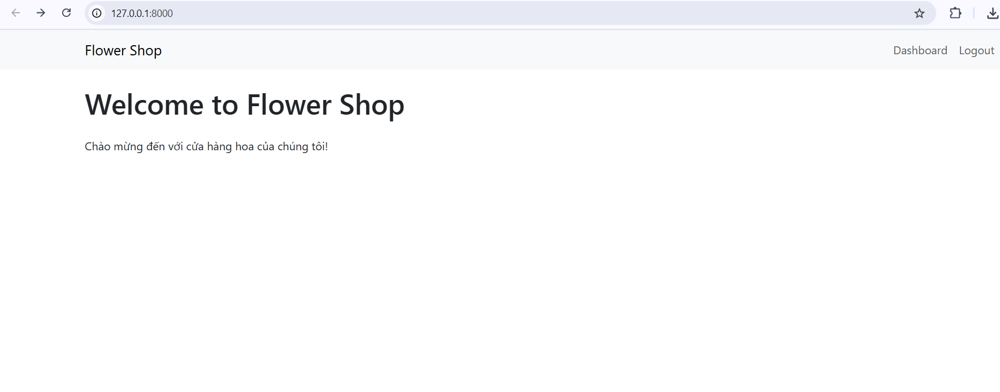

**Trang đăng nhập**
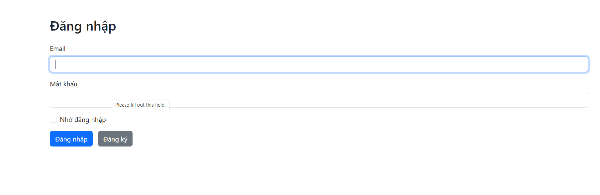

**Trang đăng kí**
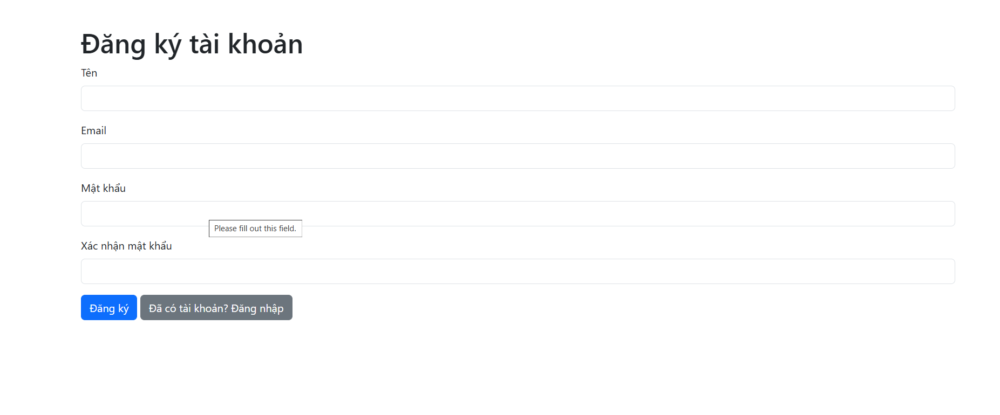

**Trang admin**
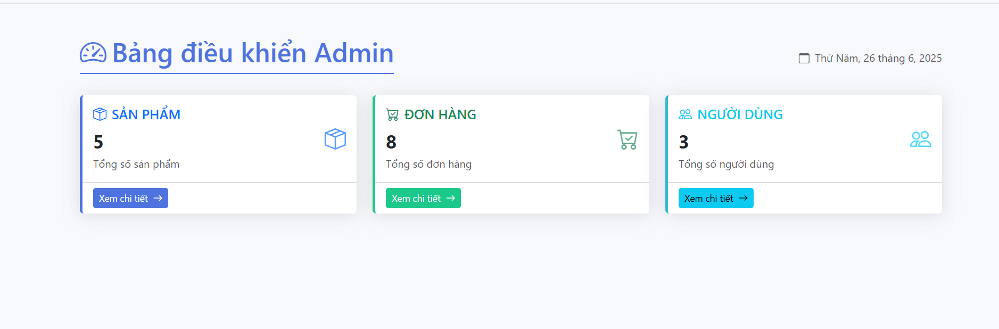

**Trang admin**
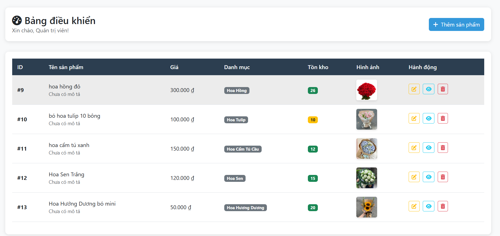

**Thêm sản phẩm**


**Sửa sản phẩm**
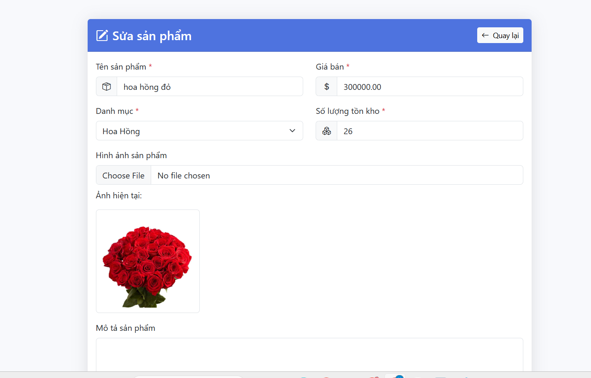

**Xóa sản phẩm**
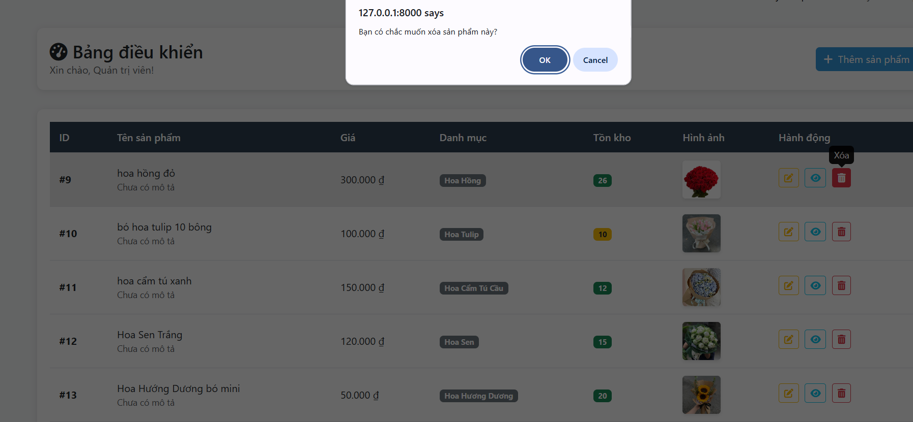

**Quản lý đơn hàng**
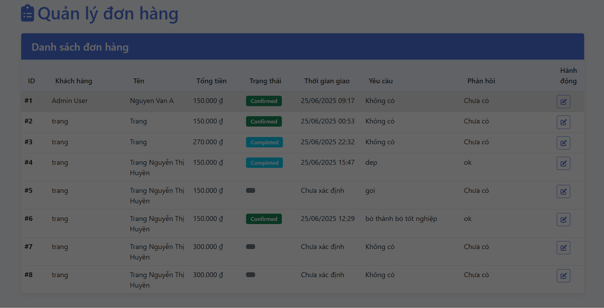

**Trang chủ user**
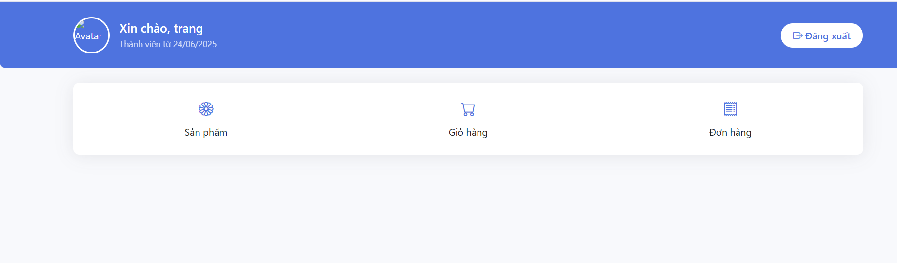

**Xem sản phẩm**
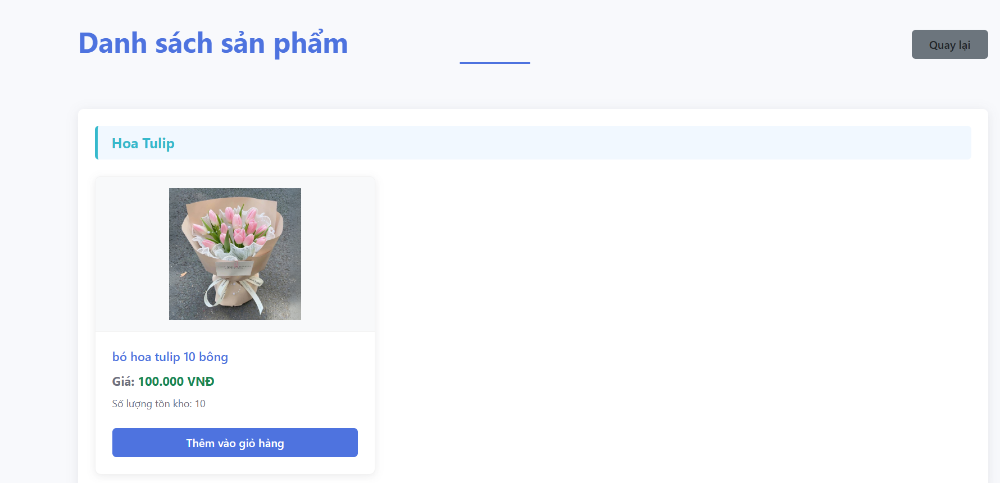

**Thêm vào giỏ hàng**
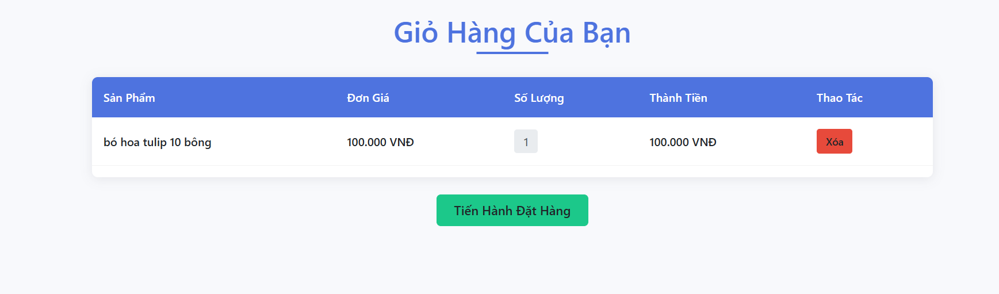

**Đặt hàng**


**Chờ xác nhận đơn hàng**
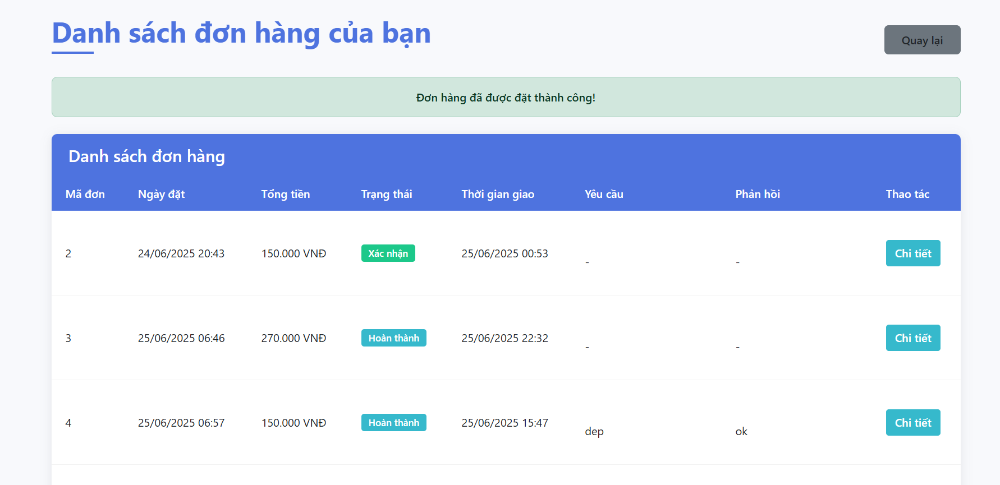

**Cập nhật đơn hàng ở admin**
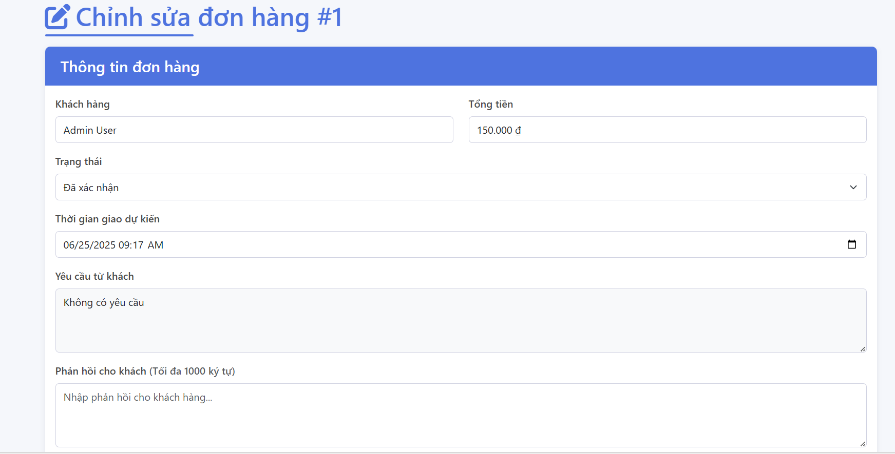

## 6. Security 
- **CSRF Protection (Bảo vệ chống Cross-Site Request Forgery)**:
  - Sử dụng token `@csrf` trong tất cả các form (ví dụ: form đặt hàng trong `user.orders.create.blade.php`), đảm bảo các request POST/PUT/DELETE được xác thực bởi Laravel middleware.
- **XSS Prevention (Bảo vệ chống Cross-Site Scripting)**:
  - Áp dụng Blade escaping với `{{ }}` để tự động thoát HTML trong các view (ví dụ: hiển thị tên sản phẩm và giá trong `user.orders.create.blade.php`), ngăn chặn việc chèn script độc hại.
- **Data Validation**:
  - Thực hiện validation phía server trong `OrderController` (ví dụ: `store` và `adminStore`) với rules như `required`, `max:255`, và `regex:/^[0-9]{10,11}$/` cho số điện thoại, đảm bảo dữ liệu đầu vào an toàn.
- **Authentication (Xác thực)**:
  - Sử dụng Laravel Breeze để cung cấp cơ chế đăng nhập/đăng xuất an toàn trong `LoginController`, với `Auth::attempt()` và `session()->regenerate()` để ngăn session fixation.
- **Authorization (Phân quyền)**:
  - Áp dụng middleware `auth` và kiểm tra `role` trong `OrderController@show` để giới hạn quyền truy cập, đảm bảo chỉ admin hoặc chủ đơn hàng có thể xem thông tin.
- **Session & Cookies Management**:
  - Quản lý session an toàn với `session()->invalidate()` và `session()->regenerateToken()` trong `LoginController@logout`, giảm nguy cơ session hijacking.
- **SQL Injection Protection**:
  - Sử dụng Eloquent ORM trong `OrderController` (ví dụ: `Order::create()`, `Product::findOrFail()`) để tránh các truy vấn SQL thô, bảo vệ chống SQL Injection.


## 7 . Dự án 
**github link** : https://github.com/htrsng/btl_web


